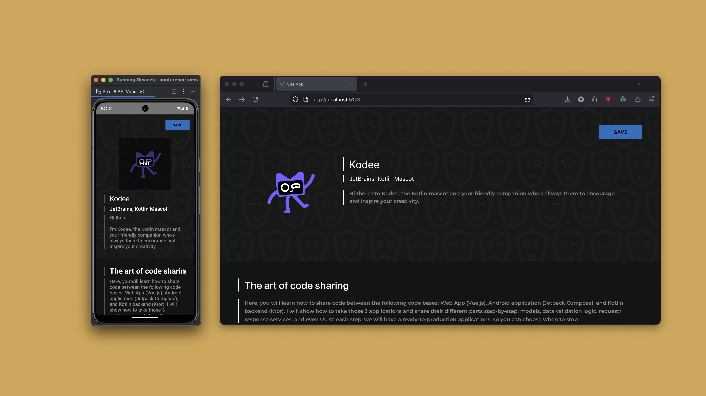

# Full Stack JVM, JS, and Android App

The project is a small Conference CMS application showcasing a full-stack approach with Kotlin Multiplatform.
It contains Ktor backend, Jetpack Compose Android application, and Vue.js web application
with five different levels of code sharing from no code sharing to a single UI for Web and Android with the same validations and DTOs between it and backend.

- [main](../../) - Initial step with three different applications with no sharing
- [step-1-share-models](../../tree/step-1-share-models) - Share [DTOs](https://en.wikipedia.org/wiki/Data_transfer_object) between backend and two client applications
- [step-2-share-validations](../../tree/step-2-share-validations) - Share validation rules for data between backend and two client applications
- [step-3-share-api-requests](../../tree/step-3-share-api-requests) - Share API client between Android and Vue.js application
- [step-4-share-components](../../tree/step-4-share-components) - Re-use some of the Android application UI parts inside the Vue.js application
- [step-5-share-client-application](../../tree/step-5-share-client-application) - Use a single code-base for two client applications (Android and Web) with Compose Multiplatform

## Requirements

- Java 11+ (can be installed via [asdf](https://github.com/asdf-vm/asdf) or [SDKMAN!](https://sdkman.io/))
- Node.js 20+ (can be installed via [asdf](https://github.com/asdf-vm/asdf) or [nvm](https://nodejs.org/en/download))

## Getting started

To run just the application.
- Install frontend dependencies with `npm install`
- Run the backend with `npm run start:api`
- Run the frontend with `npm run start:web`
- Go to `http://localhost:5173/`

> **Notes:** on the step [step-5-share-client-application](./tree/step-5-share-client-application) to run the web application, you need to use `npm run start:composeWeb`